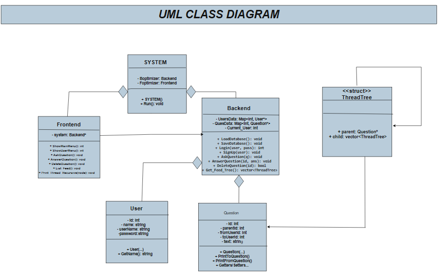

# AskMe Project (C++ Console Application) 🚀

A fully functional Q&A platform (similar to AskFM) built from scratch using **C++**. 
The project demonstrates strong understanding of **OOP**, **Data Structures**, and **System Architecture**.

## 📌 Features
- **User System:** Sign up, Login, Logout, and User Management.
- **Question System:** Ask anonymous/public questions, Answer questions, Delete questions.
- **Feed System:** View questions thread (Parent/Child relationship) using Recursion.
- **Data Persistence:** Automatically loads and saves data to files.

## 🏗️ System Architecture
The project follows a modular architecture separating the **Frontend** (UI), **Backend** (Logic), and **Data Models**.



## 🛠️ Technical Concepts Used
- **Object-Oriented Programming (OOP):** Encapsulation, Composition, Association.
- **Data Structures:** `std::map` for fast lookups, `std::vector`, and Custom `Structs`.
- **Algorithms:** Recursion for printing Question Threads.
- **File Handling:** Reading/Writing databases to text files.
- **Clean Code Principles:** Separation of concerns (Frontend vs Backend).

## 🚀 Sample Run
```text
Menu:
        1) Login
        2) Sign Up
        3) Exit
Enter number in range 1 - 3: 1
Enter username: rewan
Enter password: ***
Welcome back, rewan ebrahim
...