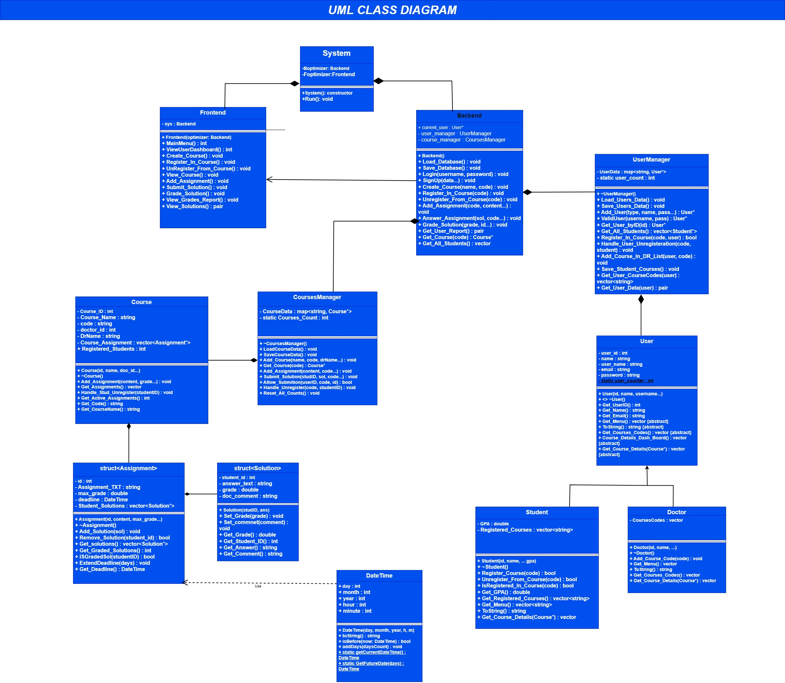

# 🎓 Educational Management System

A robust, console-based Educational Management System built with **C++** and **Object-Oriented Programming (OOP)** principles. This system manages the complete lifecycle of an academic environment, including Doctors, Students, Courses, Assignments, and Solutions.

## 🚀 Key Features
* **Role-Based Access:** Distinct functionalities for Doctors (Creators) and Students (Consumers).
* **Memory Safety:** Implemented strict memory management using **Destructors** and Composition relationships to ensure **Zero Memory Leaks**.
* **Data Persistence:** Custom file-handling engine to save/load complex data structures (Courses, Assignments, Grades) simulating a real database.
* **Polymorphism:** Leveraged inheritance and virtual functions to handle different user behaviors seamlessly.
* **Smart Interactions:** Handles edge cases like student unregistration, grade reports, and deadline validations.

## 🏗️ System Architecture (UML Class Diagram)
Designed using strict OOP principles, emphasizing Composition for robust memory management and Separation of Concerns.

## 🛠️ Future Improvements
* **String Optimization:** Current implementation passes strings by value for simplicity. In a production environment, I would refactor this to use `const string&` to optimize memory usage and avoid unnecessary copying. I prioritized System Stability and Architecture over micro-optimizations for this version.
* **GUI:** Transitioning from Console UI to a graphical interface using Qt.

## 💻 How to Run
1.  Clone the repository.
2.  Compile the source files using any C++ compiler (Visual Studio / GCC).
3.  Run the executable.
4.  Enjoy the simulation!
