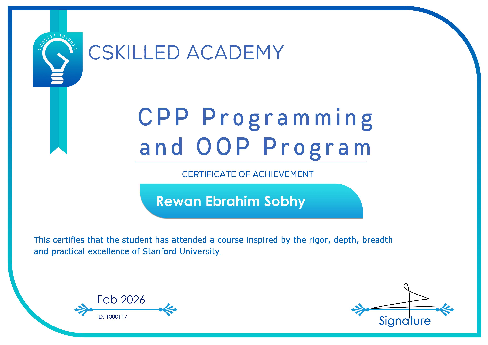

# OOP Course Projects – C++

### Based on Dr. Mostafa Saad's OOP Course

## 📌 Overview

This repository contains my complete implementations of the required projects from Dr. Mostafa Saad’s Object-Oriented Programming (OOP) course.

The projects are designed to simulate structured, real-world problem-solving scenarios using C++ and Object-Oriented Design principles.  
Each implementation was written from scratch with a focus on clarity, maintainability, and solid architecture.

---

## 🧠 Concepts Applied

Throughout these projects, I applied and practiced:

- Encapsulation and data hiding  
- Abstraction through well-defined class interfaces  
- Inheritance and runtime polymorphism  
- Composition vs. inheritance design decisions  
- SOLID principles  
- Separation of concerns  
- Clean code and modular structure  
- Edge-case handling and input validation  

---

## 🛠 Technical Focus

- C++ (OOP-based design)
- Class modeling and responsibility assignment
- Memory management fundamentals
- STL usage where appropriate
- Problem decomposition into scalable components

---

## 📂 Repository Structure

Each project directory includes:

- Clear class separation  
- Logical file organization  
- Meaningful naming conventions  
- Structured implementation following course specifications  

All projects are standalone implementations.

---

## ⚠️ Academic Integrity

While the project requirements follow the official course specifications,  
all implementations in this repository are entirely my own work.  
Every line of code was written independently to ensure deep understanding and practical mastery.

---

## 🎓 Course Completion

Successfully completed the CPP Programming and OOP Program  
CSkilled Academy – February 2026

